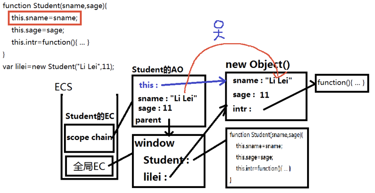
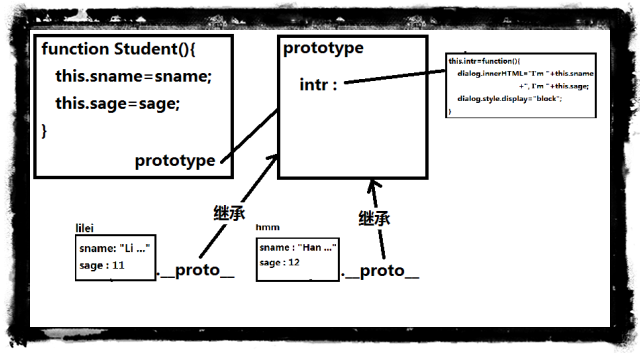
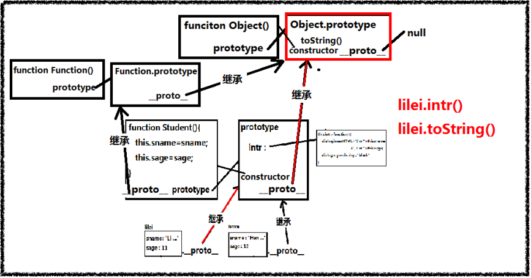

# 原型链
## 面向对象
程序中都是先用对象来描述现实中一个事物，再根据需要调用对象的方法。
:::tip
从本质上说：
    内存中集中存储多个数据和方法（函数）的存储空间，然后取一个名字
:::
## 创建对象
### 对象直接量
```js
let obj={
  属性名:属性值,
  属性名:属性值,
     ......
  属性名:属性值,
  方法名:function(){
   ... this.属性名 ...
 }
}
```
:::tip
使用对象直接量创建对象揭露对象实质：
+ js中一切对象底层都是关联数组，
+ 对象的属性名其实就是关联数组的key
+ 对象的方法名其实就是关联数组的value
:::
### 构造函数
描述一类对象统一结构的特殊函数
```js
function 类型名(属性参数){
    this.属性名＝属性参数;
    this.方法名＝function(){
    ……this.属性名……
  ｝
｝
let obj ＝ new 类型名(属性值)
```
+ 先定义构造函数：
```js
function Student(sname,sage){
      this.sname = sname;
      this.sage=sage;
      this.intr(){
        console.log('hello world')
    }
}
```
+ 用new调用构造函数，传入属性值作为参数，获得新对象
```js
let obj = new Student('Jack',10)
```

其中
:::warning
this:
+ 自动引用正在调用当前方法的.前对象
+ obj.fun()中：fun中的this调用obj
+ new Fun（） ：Fun中的this－>正在创建的新对象
+ XXX.prototype.fun() fun中的this->将来调用
+ 如果this不是想要的  fun（）.call替换
:::
:::warning
new
+ 创建空对象：new Object（）；
+ 让新对象的__proto__继承构造函数的prototype
+ 用新对象调用构造函数：将构造函数中的this自动转换成新对象
+ 返回新对象的地址
:::

图例


可以看出来：
构造函数可以做到代码重用，但是因为每次都需要new一个新对象，从而导致对象的方法会被重复创建，造成内存浪费。
## 继承
### 原型对象
集中存储一类子对象共有成员的父对象
### 访问原型对象
+ 定义构造函数时，都会自动定义一个该构造函数的原型对象
+ 构造函数中有一个prototype属性值指向当前类型的原型对象


:::tip
+ 访问：构造函数.prototype
+ 向原型对象中添加成员：构造函数.prototyle.成员＝function
+ 构造函数创建的子对象，都有_proto_属性继承构造函数的原型对象
:::
### 自有属性和共有属性
|         | 自有属性           | 共有属性        |
| ------------- |:-------------| :-----|
| 定义     | 直接保存在子对象本地的属性 | 保存在父级原型对象中，被所有子对象共用属性 |
| 扩展     | 对象.属性名＝值      |   构造函数.prototype.属性名＝值 |
|           | delete 对象.属性名| delete 构造函数.prototype.属性名|
| 判断 | var bool = obj.hasOwnProperty(“属性值”)     |    !obj.hasOwnProperty("属性名")&&(对象.属性名!=undefined) |

:::danger
内置对象的原型对象								
 + new Array() String()  RegExp() Date() Error() Function() Object()
 + 这些都是构造函数，每个类型都对应自己的prototype对象,prototype对象中集中存储了该类型可用的所有API
:::
## 原型链
由各级父元素继续继承，形成的链条


## this 的使用场景
+ 这是函数的最通常用法，属于全局性调用，因此this就代表全局对象
+ 既函数还可以作为某个对象的方法调用，这时this就指这个上级对象
+ 所谓构造函数，就是通过这个函数，可以生成一个新对象。这时，this就指这个新对象
+ apply()是函数的一个方法，作用是改变函数的调用对象。它的第一个参数就表示改变后的调用这个函数的对象。因此，这时this指的就是这第一个参数。


