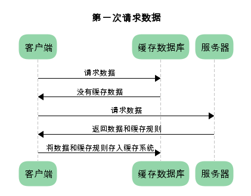
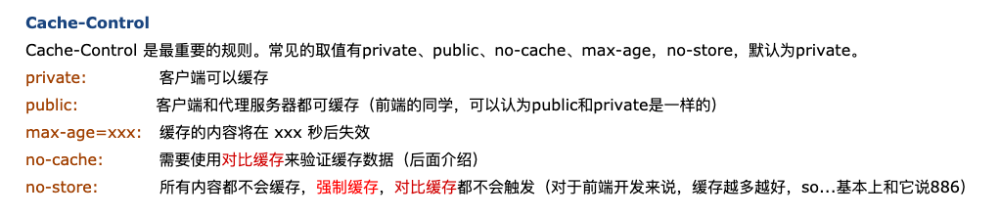
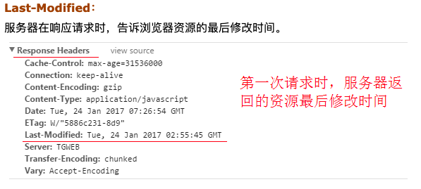
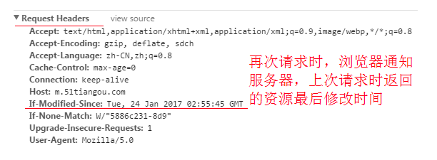
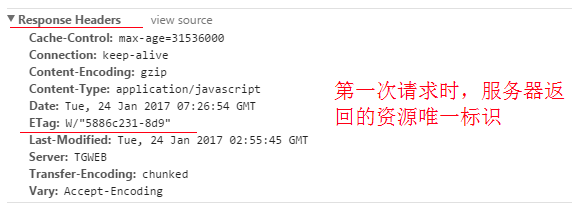
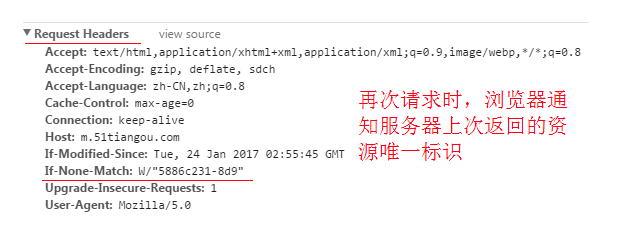
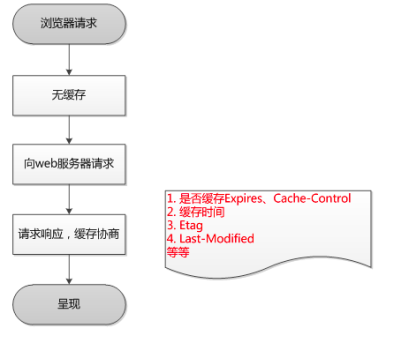
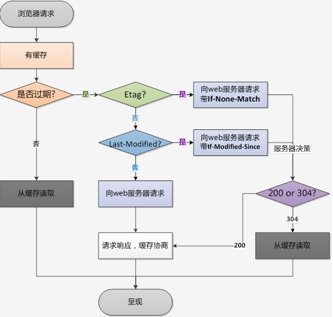

# 浏览器缓存
## 什么是浏览器缓存
### 浏览器缓存简介
+ Web缓存是指一个Web资源（如html页面，图片，js，数据等）存在于Web服务器和客户端（浏览器）之间的副本。缓存会根据进来的请求保存输出内容的副本；当下一个请求来到的时候，如果是相同的URL，缓存会根据缓存机制决定是直接使用副本响应访问请求，还是向源服务器再次发送请求。
+ 比较常见的就是浏览器会缓存访问过网站的网页，当再次访问这个URL地址的时候，如果网页没有更新，就不会再次下载网页，而是直接使用本地缓存的网页。只有当网站明确标识资源已经更新，浏览器才会再次下载网页。浏览器和网站服务器是根据缓存机制进行缓存的
### 非HTTP协议定义的缓存机制
+ ```html 
    <meta http-equiv="Pragma" content="no-cache">
  ```
## 简述http报文
+ HTTP报文就是浏览器和服务器间通信时发送及响应的数据块。
+ 浏览器向服务器请求数据，发送请求(request)报文。
+ 服务器向浏览器返回数据，返回响应(response)报文。
+ 报文信息主要分为两部分
   + 1.包含属性的首部(header)-----附加信息（cookie，缓存信息等）与缓存相关的规   则信息，
       均包含在header中
   + 2.包含数据的主体部分(body)-----HTTP请求真正想要传输的部分

## 缓存规则解析
 根据是否需要重新向服务器发起请求来分为：强制缓存和对比缓存

### 强制缓存
+ 在没有缓存数据的时候，浏览器向服务器请求数据时，服务器会将数据和缓存规则一并返回，缓存规则信息包含在响应header中。
:::tip
响应header中会有两个字段来标明失效规则（Expires/Cache-Control）
:::

### 对比缓存
+ 对比缓存，顾名思义，需要进行比较判断是否可以使用缓存。
+ 浏览器第一次请求数据时，服务器会将缓存标识与数据一起返回给客户端，客户端将二者备份至缓存数据库中。
+ 再次请求数据时，客户端将备份的缓存标识发送给服务器，服务器根据缓存标识进行判断，判断成功后，返回304状态码，通知客户端比较成功，可以使用缓存数据。
:::warning
对于对比缓存来说，缓存标识的传递是我们着重需要理解的，它在请求header和响应header间进行传递.
:::
#### Last-Modified / If-Modified-Since


#### Etag / If-None-Match


### 总结
+ 对于强制缓存，服务器通知浏览器一个缓存时间，在缓存时间内，下次请求，直接用缓存，不在时间内，执行比较缓存策略。
+ 对于比较缓存，将缓存信息中的Etag和Last-Modified通过请求发送给服务器，由服务器校验，返回304状态码时，浏览器直接使用缓存。
#### 第一次请求

#### 第二次请求

